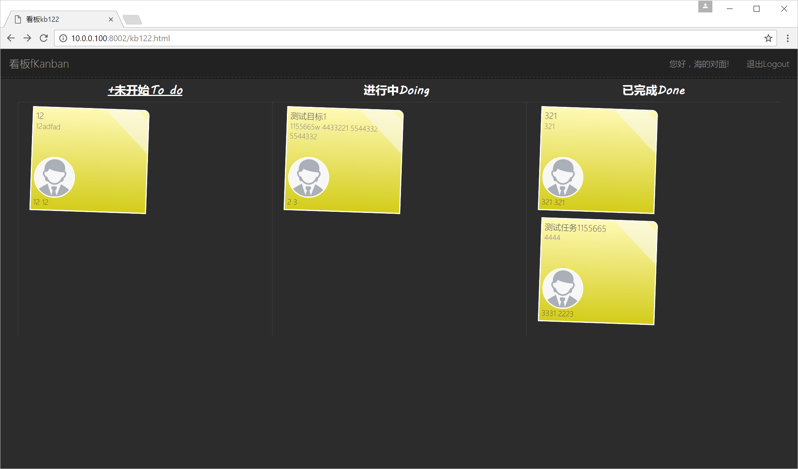

### 一个极简的看板管理工具，基于PostgreSQL + Redis + Nodejs实现

#### 环境搭建

1. 首先机器上需要安装Docker，[Install Docker](https://docs.docker.com/engine/installation/)，pg+redis+nodejs都运行在docker容器内
2. 启动[Postgres](https://store.docker.com/images/postgres)容器
```
docker run --name pg -e POSTGRES_PASSWORD=your-password-here -e POSTGRES_DB=kanban -d postgres
```
3. 启动[pgweb](https://github.com/sosedoff/pgweb)，一个基于WEB的postgreSQL管理工具，小而美
```
docker run -p 8081:8081 -d --name pgweb --link pg:pg -e DATABASE_URL=postgres://postgres:your-password-here@pg:5432/kanban?sslmode=disable sosedoff/pgweb
```
4. 初始化数据表，脚本参见`/scripts/doc.sql`
5. 启动[Redis](https://store.docker.com/images/redis)容器
```
docker run -d -p 6379:6379 --name redis redis
```
6. 克隆项目
```
git clone https://github.com/korndorben/kanban.git
npm install
```
7. 在项目根目录下编译`Dockerfile`
```
docker build -t node790 .
```
8. 运行看板容器
```
docker run -d -v $(pwd):/src -p 8002:3000 --name kanban node790
```
9. 找到本机的IP地址，访问例如[http://10.0.0.100:8002](http://10.0.0.100:8002)地址
10. 使用微信扫码登录，需要电脑和手机使用同一个WIFI，不然回调进不来
11. 完成

